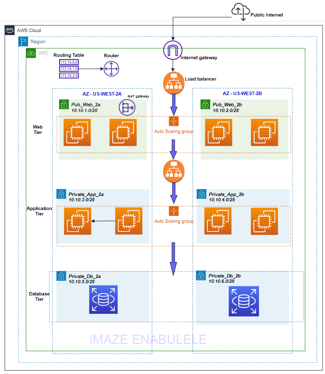

# Secure 3-Tier VPC Architecture on AWS

## 📌 Project Overview
This project demonstrates a production-style 3-tier architecture deployed in AWS using high availability and security best practices.
## 🏗 Architecture Diagram

The architecture includes:
- Custom VPC
- Public & Private Subnets across 2 Availability Zones
- Internet Gateway
- NAT Gateway
- Application Load Balancer
- Auto Scaling Group
- Multi-AZ RDS

---

## 🏗 Architecture Design

Traffic Flow:
Internet → ALB → Private EC2 → Private RDS

Key Features:
- Multi-AZ deployment
- Private application and database layers
- No public IP for backend servers
- Layered security groups
- Cost-aware resource configuration

---

## 📂 Documentation
Detailed documentation available in `/docs` folder.

---

## 🔐 Security Highlights
- Database isolated in private subnet
- SSH access restricted via Bastion Host
- Security groups allow least privilege access
- No direct internet access to database

---

## 📊 High Availability
- Load Balancer distributes traffic
- Auto Scaling ensures elasticity
- RDS Multi-AZ for failover support

---

## 💰 Cost Considerations
- t2.micro instances
- Resources stopped after testing
- NAT Gateway deleted post demo

---

## 🚀 Future Enhancements
- Infrastructure as Code (CloudFormation)
- HTTPS using ACM
- AWS WAF integration
